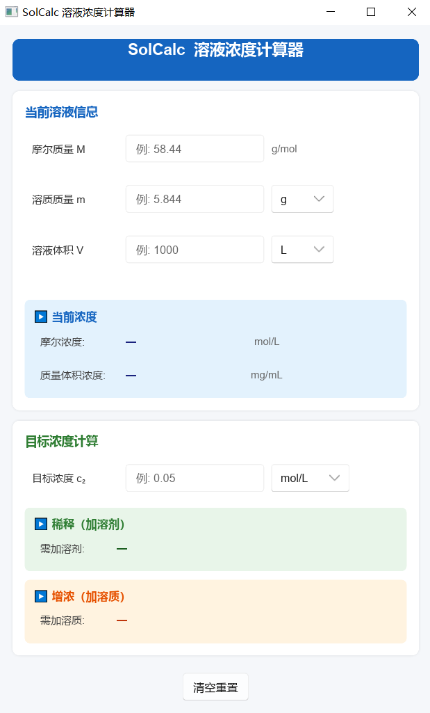

# SolCalc 溶液浓度计算器

一款面向实验室人员的 Windows 桌面工具，用于快速计算溶液浓度、稀释量和增浓量。基于 **Rust + Slint** 构建，单文件可执行，无需安装任何运行时。



---

## 功能

### 当前溶液浓度计算
输入溶质摩尔质量、质量和溶液体积，实时输出：
- 摩尔浓度（mol/L）
- 质量体积浓度（mg/mL）

### 目标浓度计算
在当前溶液基础上输入目标浓度，自动判断并给出：
- **稀释路径**：需加入溶剂的体积（c₂ < c₁）
- **增浓路径**：需加入溶质的质量（c₂ > c₁）

### 单位支持

| 类型 | 可选单位 |
|------|----------|
| 质量 | g、mg |
| 体积 | L、mL |
| 浓度 | mol/L、mmol/L、μmol/L、mg/mL、μg/mL、g/L |

### 其他
- 输入实时验证，非法值红色提示
- 结果保留 4 位有效数字，自动切换科学计数法
- 一键清空重置

---

## 从源码构建

**环境要求：** Rust 1.75+，Windows 10+

```bash
git clone https://github.com/liuyinzhe/solcalc_rs.git
cd solcalc_rs
cargo build --release
```

产物位于 `target/release/solcalc_rs.exe`。

---

## 技术栈

- [Rust](https://www.rust-lang.org/)
- [Slint](https://slint.dev/) — 声明式 GUI 框架

---

## License

MIT
